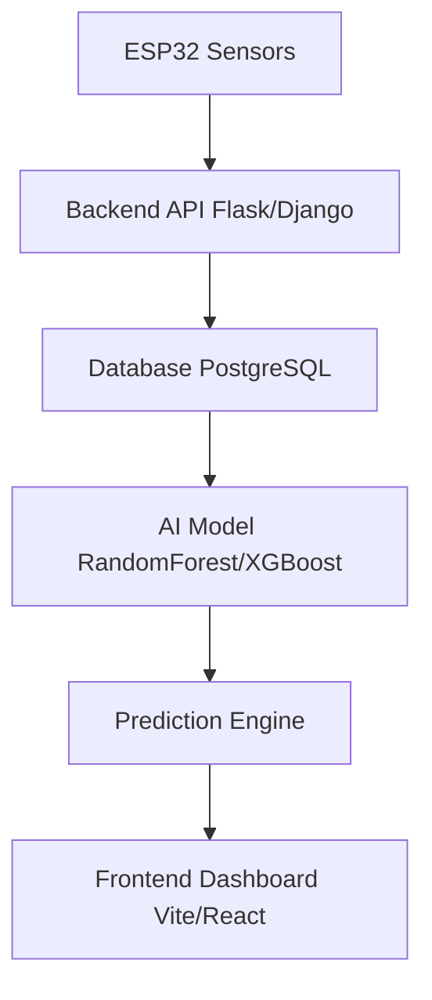

# Waterborne Diseases Detection System — Project Wiki

## 1. System Overview
   - Purpose: Design and implement a web-based AI system that predicts the likelihood of waterborne disease outbreaks using water quality, environmental, and socioeconomic data.
   - Target Users: Doctors, hospitals, admins, outreach workers, and analysts.
   - Core problem being solved: Real-time outbreak monitoring, early warning alerts, and AI-powered symptom clustering for waterborne diseases like Cholera and Typhoid.

## 2. Architecture Diagram

## 3. Directory Structure
- `/src`: Main application source code
- `/backend`: Flask backend application
- `/backend/models`: SQLAlchemy database models
- `/backend/routes`: Flask blueprints and route definitions
- `/backend/services`: Business logic and ML integration services
- `/src/components`: Reusable UI elements and layout components
- `/src/data`: Mock datasets and constants
- `/src/hooks`: Custom React hooks for state and data management
- `/src/lib`: Utility functions and integrations
- `/src/pages`: Application views corresponding to routes
- `/src/types`: TypeScript interfaces and type definitions
- `/public`: Static assets
- `/*.*`: Configuration files for Vite, Tailwind, TypeScript, ESLint, etc.

## 4. Routing Map
- `/` | Dashboard (`Index.tsx`) | Main overview
- `/upload` | `UploadPage.tsx` | Data upload and processing
- `/predictions` | `PredictionsPage.tsx` | AI analytics and outbreak prediction
- `/alerts` | `AlertsPage.tsx` | Alerts & notifications
- `/map` | `MapPage.tsx` | Geographic visualization
- `/cases` | `PatientCasesPage.tsx` | Patient case management
- `/water-quality` | `WaterQualityPage.tsx` | Water quality monitoring
- `/clusters` | `SymptomClustersPage.tsx` | AI symptom clusters
- `/risk` | `RiskAnalysisPage.tsx` | Risk analysis
- `/users` | `UserManagementPage.tsx` | User management (Admin)
- `/sources` | `DataSourcesPage.tsx` | Data sources management
- `/login` | `LoginPage.tsx` | Authentication
- `/*` | `NotFound.tsx` | 404 handler
- `API: POST /api/sensor-data` | `sensor_routes.py` | Ingest ESP32 sensor data
- `API: GET /api/history` | `sensor_routes.py` | Retrieve sensor data history
- `API: GET /api/prediction` | `prediction_routes.py` | Run ML model prediction

## 5. Component Registry
- `src/components/layout/AppHeader.tsx` | layout | N/A | Application top header
- `src/components/layout/AppSidebar.tsx` | layout | N/A | Application side navigation
- `src/components/layout/MainLayout.tsx` | layout | children | Wrapper for pages
- `src/components/dashboard/AlertsList.tsx` | ui | N/A | Display active alerts
- `src/components/dashboard/DiseaseChart.tsx` | chart | N/A | Visualizes disease trends
- `src/components/dashboard/OutbreakMap.tsx` | ui | N/A | Renders outbreak risks on a map
- `src/components/dashboard/RecentCases.tsx` | ui | N/A | Shows recent clinical cases
- `src/components/dashboard/StatCard.tsx` | ui | props (title, value, etc.) | High-level statistics display
- `src/components/dashboard/SymptomClusters.tsx` | ui | N/A | Lists detected symptom clusters
- `src/components/location/LocationSelector.tsx` | ui | props | Location selection for data entry
- `src/components/predictions/PredictionCard.tsx` | ui | props | Renders individual risk predictions
- `src/components/upload/DataUpload.tsx` | ui | N/A | Component for uploading clinical data
- `src/components/ui/*` | ui | various | shadcn/ui base components

## 6. Custom Hooks Catalogue
- `useIsMobile` | `src/hooks/use-mobile.tsx` | `undefined` | `boolean` | Listens to window resize for responsive design
- `useToast` | `src/hooks/use-toast.ts` | `undefined` | `{ toast, dismiss, toasts }` | Manages toast notifications state

## 7. Data Layer
- **Mock JSON / TS**: `src/data/zimbabwe-locations.ts` contains geographical data for Zimbabwe.
- **water_pollution_disease.csv**: 
  - Column Names: Country, Region, Year, Water Source Type, Contaminant Level (ppm), pH Level, Turbidity (NTU), Dissolved Oxygen (mg/L), Nitrate Level (mg/L), Lead Concentration (µg/L), Bacteria Count (CFU/mL), Water Treatment Method, Access to Clean Water (% of Population), Diarrheal Cases per 100,000 people, Cholera Cases per 100,000 people, Typhoid Cases per 100,000 people, Infant Mortality Rate (per 1,000 live births), GDP per Capita (USD), Healthcare Access Index (0-100), Urbanization Rate (%), Sanitation Coverage (% of Population), Rainfall (mm per year), Temperature (°C), Population Density (people per km²).
  - Inferred Types: Mostly numeric, with strings for categorical fields (Country, Region, Source, Treatment).
  - Row Count: 3001
  - Current/Planned Usage: Currently unused. Planned for AI prediction model integration.
  - **TODO (Performance)**: The CSV contains > 1,000 rows. Offload CSV parsing to a Web Worker to prevent blocking the main thread.

## 8. TypeScript Types & Interfaces
- `User`, `UserRole`, `DoctorSpecialization` | `src/types/index.ts` | Auth and access control
- `WaterborneDisease`, `PatientCase`, `LabResult`, `GeoLocation`, `RiskLevel` | `src/types/index.ts` | Clinical data
- `SymptomCluster`, `OutbreakPrediction`, `CommunityRiskScore` | `src/types/index.ts` | AI and ML integration points
- `WaterQualityData`, `EnvironmentalData` | `src/types/index.ts` | Environmental telemetry
- `Alert` | `src/types/index.ts` | Notifications
- `UploadConfig`, `ValidationRule` | `src/types/index.ts` | Data ingest validation
- `DashboardStats`, `TimeSeriesDataPoint`, `MapDataPoint` | `src/types/index.ts` | Visualization parameters

## 9. State Management Map
- **Server State**: `@tanstack/react-query` configured in `src/App.tsx` (staleTime 5m).
- **Local/UI State**: `useState` and context hooks in React.
- **Backend State**: SQLite database (`waterborne_diseases.db`) managed by SQLAlchemy.
- **Toasts**: shadcn/ui and Sonner context providers.

## 10. Styling Conventions
- **Tailwind Tokens**: Custom variables in `index.css` mapped in `tailwind.config.ts` (e.g. `border`, `input`, `background`, `foreground`, `primary`, etc.).
- **shadcn/ui**: Components installed in `src/components/ui` utilizing `lucide-react` icons. Base color is slate.
- **Global CSS overrides**: Defined in `src/index.css`.

## 11. Build & Tooling
- **Vite Plugins**: `@vitejs/plugin-react-swc`, `lovable-tagger`.
- **Path Aliases**: `@/` maps to `./src`.
- **Backend**: Flask, SQLAlchemy, Flask-Cors.
- **Environment Variables**: No specific references yet, but standard `.env` anticipated.

## 12. Known Gaps / TODOs discovered during recon
- `water_pollution_disease.csv` needs integration logic via Zod + PapaParse.
- Parsing of large CSV files (> 1,000 rows) should be moved to a Web Worker.
- The `AGENT_RULES.md` file was missing and must be created.

## 13. Changelog
- 2026-04-24 | [project_wiki.md] | Created initial project wiki based on recon data
- 2026-04-24 | [backend/*] | Scaffolded Flask backend with sensor and prediction endpoints
